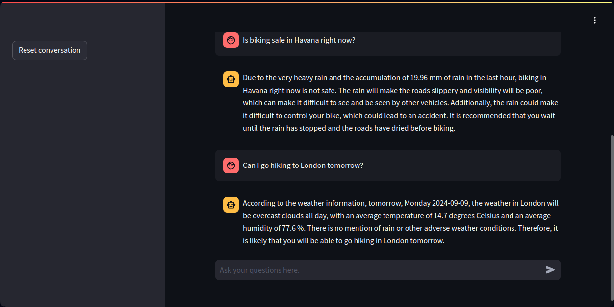
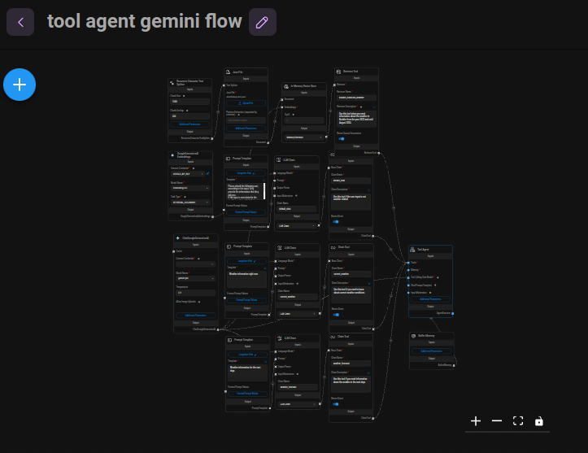
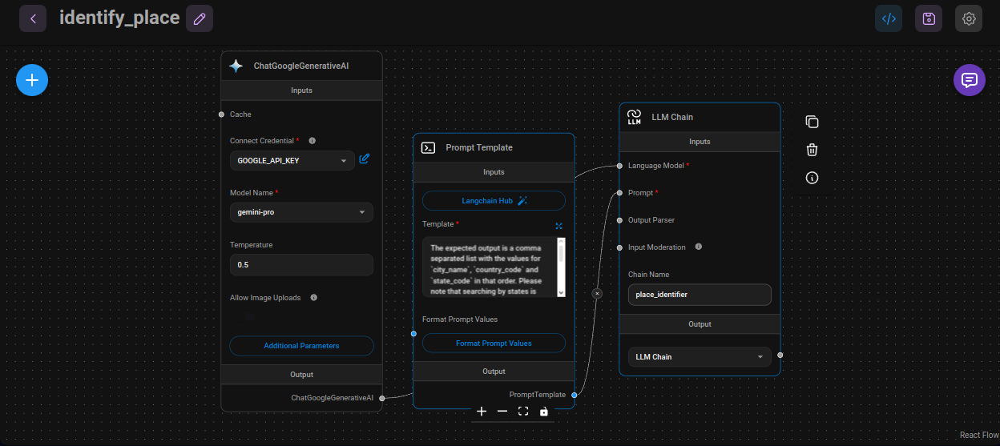

# Nimb-bot: A Weather Forecast Chatbot

## Description

The **Weather Forecast Chatbot** is a Streamlit application that allows users to inquire about weather conditions, both current and future forecasts, for Boulder, CO, as well as any city supported by the Open Weather Map API. Utilizing an already deployed Flowise AI server through its API, this chatbot employs advanced language model architectures to facilitate seamless interaction and provide accurate weather insights.

### Features

- Historical data of the weather in Boulder, CO since 2023-01-01.
- Current weather data and uture weather predictions for any supported city.
- Powered by Flowise AI for enhanced natural language understanding.
- Secure public access via ngrok.

## Installation

To get started with the Weather Forecast Chatbot, follow these steps to set up the project locally using Docker:

1. **Clone the repository** from GitLab:

    ```bash
    git clone https://gitlab.com/printai2/weather-forecast-chatbot
    cd weather-forecast-chatbot
    ```

2. **Set up your environment variables** in a .env file:

    ```bash
    HF_TOKEN=<your_huggingface_token>
    GEMINI_API_KEY=<your_gemini_api_key>
    OPEN_WEATHER_MAP_API=<your_open_weather_map_api_key>
    NGROK_AUTHTOKEN=<your_ngrok_authtoken>
    ```

3. **Build and run the application**:

    ```bash
    docker-compose up
    ```

    or, if you want to build the image:

    ```bash
    docker-compose up --build
    ```

4. **Access the application**:
   After running the above command, the console will display a URL where the chatbot can be accessed over the internet (thanks to the ngrok configuration).

## Usage

Once the chatbot is running, you can interact with it using the web interface provided by Streamlit. Ask questions about the current weather like:

### Example queries

- "What is the current temperature in Boulder, CO?"
- "Is save to go to a pool tomorrow in Havana?"
  


## Chatflows

### Tool Agent Gemini Flow

The **Tool Agent Gemini Flow** is the main chatflow for the Weather Forecast Chatbot, composed of a Tool Agent and four distinct tools. This chatflow utilizes the **gemini-pro** model as the Chat Model.

1. **Retriever Tool: "boulder_historical_weather"**
   - **Description**: Use this tool when you need information about the weather in Boulder from the year 2023 until August 2024.
   - **Functionality**: This tool handles queries related to past weather information for Boulder. It retrieves data from a vector store connected to a JSON loader.
   - **Data Transformation**: While the historical data was originally stored in a CSV format, I transformed the CSV table into string descriptions for better retrieval context. For example:
     - "Weather on January 02, 2023": "Weather on 2023-01-02 - {'min temp': '-3.3 degrees Celsius', 'max temp': '-0.6 degrees Celsius', 'rain': '2.8 mm', 'snowfall': '23.0 mm', 'fog': True}"
     - "Month temp average for August, 2024": "Month temp average for 2024-08 = 25.81 degrees Celsius"
   This approach allows the model to receive more context for each data record.

2. **Chain Tool: "default_chat"**
   - **Description**: Use this tool if the user input is not weather-related.
   - **Functionality**: This tool manages greetings and conversations that do not pertain to weather inquiries.

3. **Chain Tool: "current_weather"**
   - **Description**: Use this tool if you need to know about current weather conditions.
   - **Functionality**: This tool provides answers related to inquiries about the current weather.

4. **Chain Tool: "weather_forecast"**
   - **Description**: Use this tool if you need information about the weather in the next days.
   - **Functionality**: This tool provides answers about the predictions for the next five days' weather.



### Identify Place Flow

The **Identify Place Flow** is used as an auxiliary tool to determine the place the user is inquiring about, which is then used as input for the weather API calls. It also utilizes the **gemini-pro** model as the Chat Model.

This setup allows the chatbot to efficiently handle various weather-related queries while providing contextual and accurate responses.



## Future Ideas

- **Streaming Support**: Get the LLM model answer with streming instead of waiting until is finished.
- **User Authentication**: Add user account features for personalized forecasts and history.
- **Units choice**: Add options for units ('metric', 'standard', 'imperial') to the Streamlit interface.
- **Enhanced AI Features**: Integrate more complex conversation flows using Flowise AI.
- **Store Recent API calls**: Store recent requests to OpenWeatherMap API so is not necessary to call the API about the same place in a short time.

## License

This project is licensed under the terms of the MIT license.
